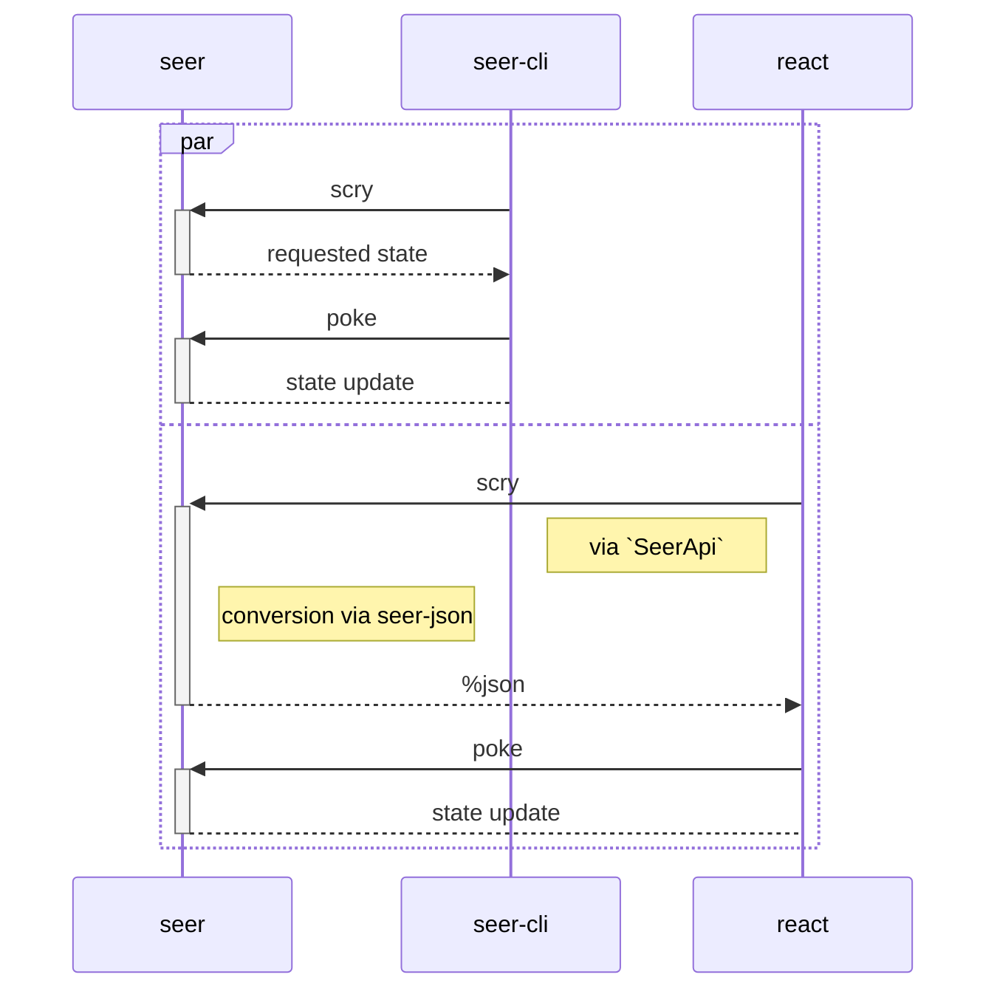

## Principles

*   Structured learning should increase **knowledge retention** and decrease **starting friction**
    
*   Robust structures are created by identifying _time-dependent_ components and defining processes around them
    
*   Spaced repetition for increasing **knowledge retention**, incremental reading for decreasing **starting friction**
    
*   The processes supporting such a structured environment are only as good as their interop - urbit's composability should be heavily leveraged.
    

## Current Design (all components)

 

<!--MERMAID {width:50}-->

<!--MCONTENT {content: "sequenceDiagram \nparticipant s as seer \nparticipant sc as seer-cli \nparticipant rf as react \npar \nsc->>+s: scry \ns\\-\\-\\>>-sc: requested state \nsc->>+s: poke \ns\\-\\-\\>-sc: state update \nand \nrf->>+s: scry \nnote left of rf: via `SeerApi`<swm-token data-swm-token=\":ui/src/api.ts:10:2:2:`class SeerApi {`\"/> \nnote right of s: conversion via seer-json \ns\\-\\-\\>>-rf: %json \nrf->>+s: poke \ns\\-\\-\\>-rf: state update \nend "} --->

 

## External Integrations

*   Anki
    
*   Roam (WIP)
    
*   Logseq (WIP)
    

## Components

*   json conversion 
    `📄 desk/lib/seer-json.hoon`
    
     
    

 

 

This file was generated by Swimm. [Click here to view it in the app](https://app.swimm.io/repos/Z2l0aHViJTNBJTNBc3JycyUzQSUzQXJ5am0=/docs/ey2r8).
