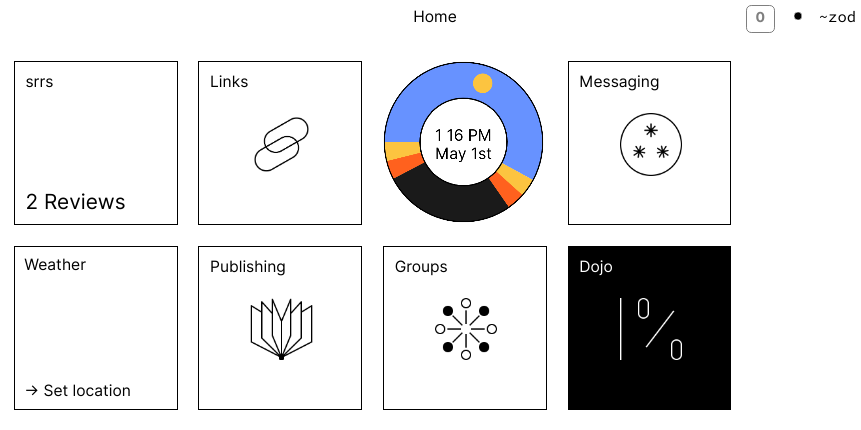
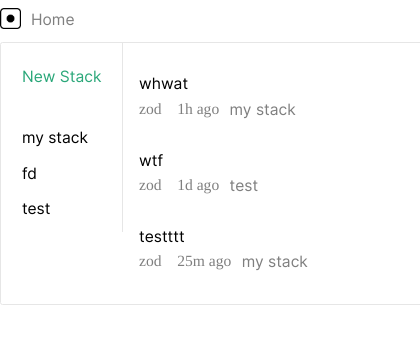

spaced repetition repetition system

**WIP**
---

---

---


*warning*: this was originally written on top of the old publish app, so there is a
lot of that code in here, especially on the front end. 

install node and npm
run with `npm serve` 

#### Troubleshooting

if you're having issues with the tile not showing up, run `:launch &launch-action [%add %srrs /srrstile '/~srrs/tile.js']` in the dojo

### Hooking into app/publish

can piggyback off of publish notebooks - title of notes are questions, bodies of
notes are answers.

put

`%+  memo  |`

in app/publish, like this:

``` hoon
...
=|  versioned-state
=*  state  -
%+  memo  |
%-  agent:dbug
^-  agent:gall
=<
  |_  bol=bowl:gall
...
```
and run `:publish +memo` - this will hook into the publish app and add all
notebooks to srrs (you need to add a new post or notebook to trigger it). 


you can also try scrying into app/publish to get the books, and then send to
srrs with a poke. better support for that path soon. 


**TODO:**
- ~~handle the scheduling of review items~~
- ~~support creating stacks/items through frontend~~
- ~~tile~~
- remove old publish artifacts
- clean up sur and lib, move to json in mar
- update landscape UI to OS1 style, probably just a full rewrite
- less shitty
