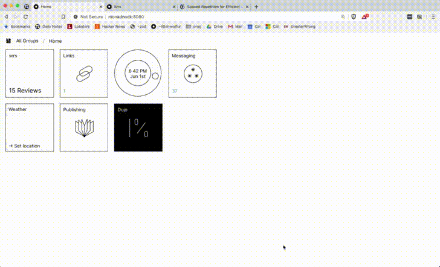
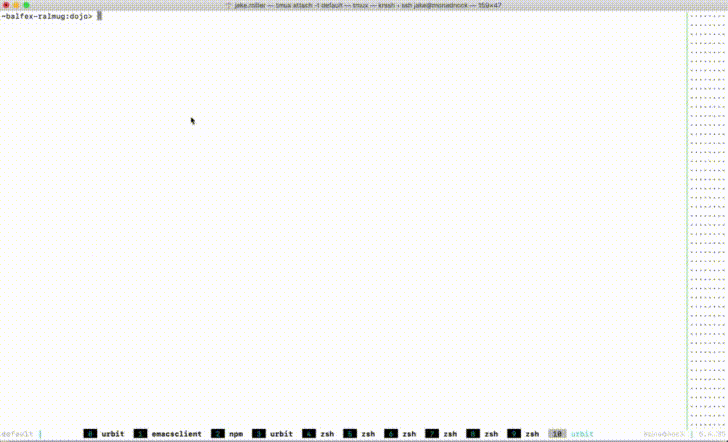

spaced repetition repetition system
---
##### Landscape UI

##### CLI


on urbit: `|merge %home ~lisdun-modsup %home`

from source: 

install node and npm

run with `npm serve` 

#### Usage

- start with `|start %srrs` in the dojo
- to  use `srrs-cli`, start it with `|start %srrs-cli` and `|link %srrs-cli`,
switch to it with C-x. create a private channel called `srrs` for notifications
to show up in chat.
  - tab complete for commands starting with `;`
  
##### Subscribing to other stacks
  - import stacks from other planets with the `;import [ship] [stack]` command
  - this will add shared stacks to a read-only (at least from the UI) set of
    subscribed stacks.
      - when you review an item, it will be copied to your personal stacks.
  - NOTE: all decks are currently public! permissioning to come soon. 

#### Troubleshooting

if you're having issues with the tile not showing up, run `:launch &launch-action [%add %srrs /srrstile '/~srrs/tile.js']` in the dojo

### Hooking into app/publish

can piggyback off of publish notebooks - title of notes are questions, bodies of
notes are answers.

put

`%+  memo  |`

in app/publish, like this:

``` hoon
...
=|  versioned-state
=*  state  -
%+  memo  |
%-  agent:dbug
^-  agent:gall
=<
  |_  bol=bowl:gall
...
```
and run `:publish +memo` - this will hook into the publish app and add all
notebooks to srrs (you need to add a new post or notebook to trigger it). 


you can also try scrying into app/publish to get the books, and then send to
srrs with a poke. better support for that path soon. 


**TODO:**
- ~~handle the scheduling of review items~~
- ~~support creating stacks/items through frontend~~
- ~~tile~~
- remove old publish artifacts (almost done)
- clean up sur and lib, move to json in mar (started)
- ~~update landscape UI to OS1 style, probably just a full rewrite~~
- less shitty
